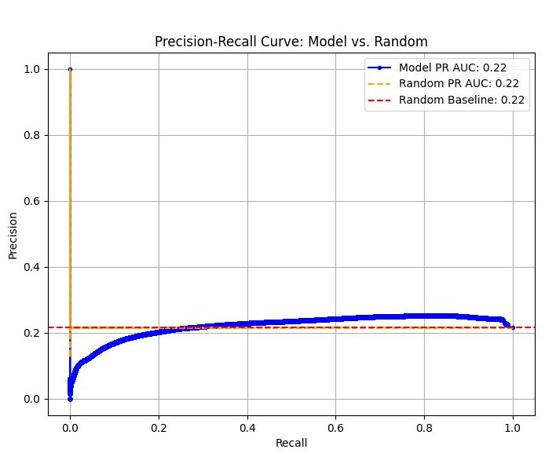
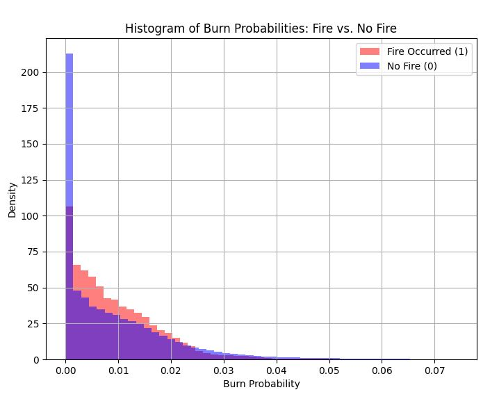

# Under Fire: Rethinking Wildfire Predictions

  

**A Critical Analysis of Oregon State's Wildfire Hazard Model**

  

*Examining the probabilities and performance in forecasting wildfire occurrences*

    
---
  

**Curated by:** Jeremy Kauwe  
**Date:** 2/5/2025

  

# 1. Executive Summary

In public policy, models are expected to provide reliable, evidence-based insights that inform critical decisions. They must be rigorously validated and demonstrate predictive performance well above trivial baselines. It is unacceptable for a model—especially one that influences resource allocation and public safety—to perform on par with a random number generator.

Our analysis of Oregon State's Wildfire Hazard Model reveals alarming shortcomings:
- **Inaccuracy in Probability Assignment:** The model fails to distinguish between fire and no-fire events.
- **Randomness Equivalence:** When benchmarked against a random number generator, the model's ability to classify fire occurrences is no better than chance.
- **Severe Risk Overestimation:** The model inflates wildfire risk by nearly 80%, potentially leading to misdirected policy and resource decisions.

These findings raise serious questions about the validity of the methods used in assessing the model's outputs. For a tool intended to guide public policy, the expectation is clear: models must deliver actionable, robust, and clearly superior predictions—not results that mimic random chance.

# 2. Introduction

**Background:**  
Wildfire hazard assessment is a critical tool for land management, public policy, and disaster preparedness. These assessments rely on models that estimate the likelihood and potential impact of wildfires based on environmental conditions, historical data, and fire behavior simulations. A key component of these assessments is burn probability, which represents the estimated likelihood of a fire occurring in a given area. This probability is often combined with fire intensity predictions to produce a final hazard rating used in risk mitigation strategies. However, the modeling process used to esimate the 2025 Oregon Wildfire hazard map is not well documented, making it difficult to assess the validity of its outputs.

**Purpose:**  
This report evaluates the relationship between the model’s probability output and its ability to distinguish between large fire events and non-fire events.

**Scope:**  
This analysis focuses on probability model outputs for all of Oregon to determine whether the model meets the necessary standards for guiding public policy and wildfire risk management.

# 3. Data and Methodology

## Data Sources  

The data used in this analysis comes from multiple sources, including model outputs from Oregon State University, historical wildfire occurrence records, and a transformed dataset created by combining these sources. These datasets were obtained through Oregon State’s Wildfire Hazard Risk **Point of Contact (POC)** and serve as the foundation for evaluating the burn probability component of the wildfire hazard model.

- **1) Transformed Data:**  
  This dataset is derived from a combination of **burn probability estimates** from the wildfire hazard model and **historical wildfire records**. Each row in the dataset represents a single **pixel** where these two datasets overlap. The dataset includes:  
  - **Burn Probability:** The probability of fire occurrence for that pixel, as assigned by the wildfire hazard model.  
  - **Fire Occurrence Flag:** A binary indicator (1 = fire occurred, 0 = no fire) derived from historical wildfire data.  
  - **Spatial Resolution:** Each pixel is spaced **500 feet apart** both vertically and horizontally, ensuring a uniform grid structure.

  The dataset consists of two columns:

    1. **Burn Probability**  
     - Represents the probability of a fire occurring in a given pixel, ranging from **0.000000** to **0.074283**.  
     - Uses a **grayscale gradient**, where black represents low probability and white represents high probability.  
     - **Descriptive Statistics:**
       - **Total Count**: 12,019,460 pixels
       - **Mean**: 0.00925
       - **Median (50%)**: 0.00621
       - **Standard Deviation**: 0.01021
       - **Min Value**: 0.000000
       - **25th Percentile**: 0.00108
       - **75th Percentile**: 0.01401
       - **Max Value**: 0.07428

          

    2. **Fire Occurrence (Binary Indicator)**  
     - Indicates whether a fire historically occurred in that pixel (**2000–2021**).  
     - **0 (No Fire)**: 78.45% of pixels  
     - **1 (Fire Occurred)**: 21.55% of pixels  

  
- **2) Wildfire Hazard Model Data:**  
  This dataset, provided by Oregon State, was used to build the wildfire hazard model. The burn probability outputs are stored in a geodatabase and were extracted for analysis.  
  **Path to Burn Probabilities:**  
  `SB80PublicData >> FireModelingData >> FireModeling_FuelscapeData.gdb >> BurnProbability`

- **3) Historical Fire Data:**  
  This dataset contains recorded wildfire events from **2000 to 2021** and was used to validate the model’s predictive accuracy. The dataset includes only fire events where **acres burned exceeded 247**, ensuring that only significant fire occurrences were considered. To maintain the focus on naturally occurring and uncontrolled wildfire events, **prescribed burns and resource management fires were excluded** from the analysis.

A full list of dataset links and additional details can be found in the **[GitHub README](https://github.com/yourusername/wildfire-risk-analysis/blob/main/README.md)**. For further information or verification, inquiries can be directed to **OSUwildfirerisk@oregonstate.edu**.

  ## Wildfire Burn Probability Map  
  The chart represents probability values using a grayscale gradient, where lower probabilities are darker (black) and higher probabilities are lighter (white).

  ### Color Mapping:
  - **Black (0.000000 probability)**: Represents the lowest probability.
  - **White (0.072378 probability)**: Represents the highest probability.
  - **Gradient Transition**: Intermediate probabilities transition from black to white.

  ### Interpretation:
  - **Darker Regions (Near Black)**: Indicate areas with **low probability**.
  - **Lighter Regions (Near White)**: Indicate areas with **high probability**.
  - **Gradual Shading**: Helps visualize the probability distribution smoothly.

  ### Purpose:
  - The grayscale mapping **enhances visibility** of probability changes.
  - It provides a **clear, intuitive** representation without requiring numerical labels.

## Burn Probability Overlaid with Historical Fire Data  
This map overlays the model’s burn probability layer with historical fire occurrences (2000-2021), highlighting areas where the model predicted fire risk versus actual fire events.  The gradient color is just to make it more visually appealing

## Data Preparation  

The data was processed using **QGIS**, an open-source geographic information system. A full guide to downloading and installing **QGIS** can be found in the **[GitHub README](https://github.com/yourusername/wildfire-risk-analysis/blob/main/README.md)**. The following steps were taken to compile the **Transformed Data** for analysis:  

1. **Loading the Data:**  
   - The **burn probability layer** from the wildfire hazard model was uploaded into QGIS.  
   - The **historical fire occurrence dataset** was also uploaded.  

2. **Ensuring Consistent Coordinate Reference System (CRS):**  
   - Both datasets were checked to confirm they used the same **Coordinate Reference System (CRS)** to ensure spatial accuracy.

3. **Creating a Grid of Points:**  
   - A grid of points was generated, with each point spaced **500 feet apart** both **vertically** and **horizontally** across Oregon.  
   - This ensured that the data was evenly sampled across the study area.

4. **Extracting Burn Probability and Fire Occurrence:**  
   - For each grid point, the corresponding **burn probability** value was captured from the model output.  
   - The historical fire dataset was overlaid, and a **binary fire occurrence flag** was assigned:  
     - `1` if a fire was recorded at that location.  
     - `0` if no fire was recorded.

5. **Handling Null Values:**  
   - Some fires extended beyond **Oregon's boundaries**, resulting in missing burn probability values.  
   - These **null values** were removed to ensure clean and complete data.

6. **Exporting the Final Dataset:**  
   - The cleaned grid layer was saved and exported as a **CSV file**.  
   - This CSV file, referred to as the **Transformed Data**, is available in the **ZIP file linked in the README**.  

This transformed dataset serves as the foundation for evaluating the **relationship between burn probability estimates and actual fire occurrences** in Oregon.

---
# **Methodology**

To evaluate how well the model predicts fire occurrences, we conducted several tests. These tests help determine whether the model provides meaningful predictions or if its results are no better than random guessing. Below, we explain these tests in simple terms and why they matter.

---

## **1. Evaluating Model Performance**

Predicting fire occurrences requires a balance between two key factors: **precision and recall**. Additionally, we use the **Precision-Recall Curve and its Area Under the Curve (PR-AUC)** to assess the model’s overall effectiveness.

### **1.1 Precision and Recall**
When predicting fire occurrences, we measure how well the model identifies fire-prone areas using two key metrics:

- **Precision (How many predicted fires were correct?)**  
  - If the model predicts **100 locations** where fire will occur and **60 of them actually had a fire**, the precision is **60%**.
  - **Higher precision** means fewer false alarms (incorrect fire predictions).

- **Recall (How many actual fires did the model catch?)**  
  - If there were **100 actual fire locations** and the model correctly identified **60 of them**, the recall is **60%**.
  - **Higher recall** means fewer missed fires.

These two measures often **trade off** against each other.  
- If the model is **too aggressive**, it catches **all** real fires but **creates many false alarms** (low precision, high recall).  
- If the model is **too cautious**, it avoids false alarms but **misses many real fires** (high precision, low recall).  

We need a **balance**, which leads us to the **Precision-Recall Curve**.

### **1.2 Precision-Recall Curve and AUC Calculation**
Since precision and recall change depending on the model’s confidence threshold, we plot a **Precision-Recall Curve** to analyze its performance across different thresholds.

- The model assigns a **probability score** (e.g., 0.02, 0.08, 0.15, etc.) to each location, estimating the likelihood of fire occurring.
- We **vary the threshold** (the cutoff point for deciding what counts as a "fire prediction") and calculate precision and recall at **each threshold**.
- These precision-recall points are **plotted on a graph**, forming the **Precision-Recall Curve**.
- The **AUC (Area Under the Curve)** is then calculated by measuring the total area beneath this curve, representing the **average performance** of the model across all confidence levels.

### **1.3 Interpreting PR-AUC and Industry Standards**
Since PR-AUC is particularly useful for **imbalanced datasets**, it is important to compare model performance to known industry standards:

#### **Industry Benchmarks**
- **0.2 – 0.4** → Slightly better than random guessing but still weak.
- **0.4 – 0.6** → Moderate predictive power; some meaningful patterns detected.
- **0.6 – 0.8** → Good performance; the model is effective in distinguishing fire-prone areas.
- **0.8 and above** → Strong predictive ability; highly reliable for decision-making.

#### **Baseline (Random Model)**
- A **random model** will have a PR-AUC equal to the proportion of fire occurrences in the dataset.  
- If **21.55% of the data represents fire occurrences**, a random classifier would achieve a PR-AUC of **0.2155**.
- If the model’s PR-AUC is **above 0.2155**, it is **better than random** and can help identify fire-prone areas.
- If it is **close to 0.2155**, it is **not useful** because it performs similarly to random guessing.
- If it is **below 0.2155**, the model is misleading and should not be used.

---

### **2. Comparing to a Random Model**
To test whether the model is **actually predicting fires or just guessing**, we compared it to a **random number generator** that assigns probabilities at random.

- If the model **performs better than random**, it means it has **some ability to identify fire-prone areas**.
- If the model **performs similarly to random**, it means the predictions **aren’t useful for decision-making**.
- This comparison ensures that the model has **actual predictive power** rather than just appearing to perform well by coincidence.

---

### **3. Visual Analysis: Histogram Layover**
To further evaluate the model, we **compared the histograms of predicted probabilities** for locations where fires occurred and where they did not.

- If the model is working well, the histogram of fire locations should **show higher predicted probabilities** compared to non-fire locations.
- If the two histograms **overlap significantly**, it suggests the model struggles to distinguish between fire-prone and non-fire areas.
- This comparison **visually confirms whether the model's predictions form a pattern or are randomly distributed**.

This **histogram analysis** helps determine if the model provides meaningful insights or if it fails to separate fire-prone areas from non-fire areas.

---

### **4. Measuring Overestimation (False Alarms and Risk Inflation)**
To measure **how much fire risk is overestimated**, we:
- Picked a **threshold** where **precision and recall are equal** (a balanced point).
- Calculated the **overestimation rate** using:

$$
\text{Overestimate Rate} = \frac{\text{False Positives (FP)}}{\text{True Positives (TP)} + \text{False Positives (FP)}}
$$

This value represents the percentage of predicted fires that **never actually occurred**.

### **How to Interpret Overestimation**
- If the overestimation rate is **high**, it means the model **predicts too many fires that never happen**, inflating fire risk.
- If the rate is **low**, it suggests the model is more conservative but may **miss some real fires**.
- This overestimation can be **expressed as a percentage**, meaning the model overstates fire risk by **X% more than actual fires**.

This analysis **quantifies how much the model exaggerates fire likelihood**, ensuring its predictions are **not misleading**.

---

### **5. Why This Matters**
✅ **A high PR-AUC** means the model is **better than random guessing** and can help identify fire-prone areas.  
✅ **Understanding precision and recall** helps determine whether the model is prone to **false alarms or missed fires**.  
✅ **The PR-AUC score reflects the model’s overall ability** to distinguish fire-prone areas, rather than relying on a single threshold.  
✅ **Comparing to the baseline (random model)** ensures we are measuring true predictive power rather than overfitting.  
✅ **Histogram analysis provides a visual check** on whether predicted probabilities actually differentiate fire-prone and non-fire areas.  
✅ **The overestimation analysis ensures** that the model is not **artificially inflating fire risk** by predicting too many false fires.  

# 4. Results & Analysis

## Understanding the Evaluation Process  
The **burn probability model** is designed to classify areas based on the likelihood of fire occurrence. Since our goal is to assess how well it differentiates between fire and no-fire events, we evaluate it as a **classification model**.

A key challenge in this analysis is the **imbalance in the dataset**, where **fire events are much rarer than no-fire events**:

- **No Fire (0): 78.45% of pixels**  
- **Fire Occurred (1): 21.55% of pixels**  

For imbalanced datasets, standard metrics like **accuracy can be misleading**, since a model could predict **"No Fire" for all pixels and still achieve high accuracy**. Instead, we focus on **Precision-Recall AUC (PR AUC)** because:

- **PR AUC is a better metric for imbalanced datasets**, as it evaluates the trade-off between detecting fires (**recall**) and avoiding false positives (**precision**).
- **A high PR AUC indicates that a model successfully distinguishes fire vs. no-fire events**, while a low PR AUC suggests that the model lacks predictive power.

---

## Performance of the Burn Probability Model  
To evaluate the **Burn Probability Model (OSU’s model)**, we compute the **Precision-Recall AUC (PR AUC)** score.

- **PR AUC of OSU’s Model** = **0.22**
- **AUC Interpretation**: Higher values indicate better classification performance.

To understand whether the model is **better than random guessing**, we compare its performance to a **random probability generator**.

---

## Benchmarking Against Random Predictions  
When a classification model **performs no better than random**, its performance simply reflects the balance of the dataset. Since **fires occur in 21.55% of the dataset**, a completely **random model’s PR AUC should be approximately 0.22**.

To determine if the **OSU burn probability model provides meaningful classification**, we generate **random probabilities** and calculate the **PR AUC** for these random scores.

- **PR AUC of a Random Model** = **0.22**
- **Since the OSU model's PR AUC is identical to the random classifier (0.22), it provides no meaningful predictive power.**

To validate this comparison, we:
1. **Generate random probabilities** sampled from a uniform distribution between 0 and 1.
2. **Compute PR AUC** for these random probabilities.
3. **Compare the OSU model’s PR AUC to this random baseline**.

If both values are similar, then the OSU model **is functionally random and does not improve fire risk classification**.

### **Performance Comparison Chart**
| Model                     | PR AUC Score |
|---------------------------|-------------|
| **OSU Burn Probability Model** | **0.22** |
| **Random Probability Model**   | **0.22** |

This confirms that the **burn probability model does not provide any additional value over a purely random model**.

  

---

## Interpreting the Results  

The Precision-Recall AUC comparison shows that the **Burn Probability Model does not meaningfully distinguish fire from non-fire events**.  

- Since the **OSU model’s PR AUC is equal to the PR AUC of a random classifier (0.22)**, it is **no better than guessing**.  
- A useful model should have a **significantly higher PR AUC**, demonstrating that it can **correctly separate fire-prone and non-fire areas**.  
- The fact that both models perform identically indicates that **the OSU model adds no predictive value** to fire risk classification.  

These results indicate that the **Burn Probability Model does not provide actionable fire risk predictions**. If a model’s **classification power is no better than random**, then its outputs **cannot be relied upon for decision-making**.

---
## Histogram Overlap of Burn Probabilities  

### **Understanding the Burn Probability Histograms**  

The histograms display the **distribution of burn probabilities** assigned by the OSU model for two different classes:  
- **Fire Pixels** → Locations where actual wildfires occurred.  
- **No-Fire Pixels** → Locations where no wildfire was recorded.  

Each pixel in the dataset is assigned a **burn probability** between **0 and 1**, indicating how likely the model believes a fire will occur at that location. If the model is performing well, **fire pixels should have systematically higher probabilities than no-fire pixels**.

---

### **Why Overlapping Should Show Separation Between Classes**  

In a well-calibrated classification model, burn probabilities should serve as a **meaningful decision boundary** between fire-prone and safe areas. That means:  
- Fire-prone areas should have **higher burn probabilities**, forming a **distribution shifted to the right**.  
- No-fire areas should have **lower burn probabilities**, forming a **distribution shifted to the left**.  

When visualized in a **histogram**, this would appear as two distributions with **minimal overlap**, clearly distinguishing high-risk areas from low-risk areas.

---

### **Histogram Comparison of Burn Probabilities**  

The histogram below overlays the **burn probability distributions** for both fire and no-fire pixels.

  

---

### **Interpreting the Results**  

A well-performing model should **assign significantly different burn probabilities to fire and no-fire locations**, resulting in two distinct histogram distributions.

However, in this case:  
❌ **The fire and no-fire distributions overlap significantly**, meaning the model **fails to meaningfully separate fire-prone areas** from non-fire areas.  
❌ **Fire locations do not have significantly higher burn probabilities than no-fire locations**.  
❌ **The burn probabilities are not predictive of actual fire occurrence** and appear to be assigned randomly.  

Since the **burn probability distributions for fire and no-fire pixels are nearly identical**, this confirms that:  
- **The model does not successfully differentiate between high-risk and low-risk areas.**  
- **Burn probabilities are not useful for decision-making in wildfire risk assessment.**  
- **This supports the PR AUC findings, which showed that the model performs no better than random guessing.**  

These results strongly suggest that the **burn probability model is not a reliable tool for wildfire risk assessment**.

---

## Overestimation of Fire Risk Predictions  

### **Determining the Classification Threshold**  

Since the burn probability model provides **continuous probability estimates**, we must set a **threshold** to classify whether a fire is predicted to occur.  

We selected the **threshold where precision and recall are equal**, ensuring that:  
- The model is **not favoring one metric over the other**.  
- Predictions balance the **trade-off between missing fires (false negatives) and overpredicting fire risk (false positives)**.

**Selected Threshold: `0.015`**  
- **Best Threshold (Equal Precision & Recall):** `0.015`  

At this threshold, the model classifies fire risk as follows:

  
| Metric | Value |
|--------|--------|
| **True Negatives (TN)** | `7,365,736` |
| **True Positives (TP)** | `527,835` |
| **False Positives (FP)** | `2,062,943` |
| **False Negatives (FN)** | `2,062,943` |
| **Precision** | `0.2037` |
| **Recall** | `0.2037` |

---

### **Overprediction Rate and Model Performance**  

One of the most concerning findings is the **high rate of false positives**, leading to an **overestimation of fire risk**.  

We calculate the **Overprediction Rate** as:

$$
\text{Overprediction Rate} = \frac{\text{False Positives (FP)}}{\text{False Positives (FP)} + \text{True Positives (TP)}}
$$

At the selected threshold:  
- **False Positives (FP):** `2,062,943`  
- **True Positives (TP):** `527,835`  
- **Overprediction Rate:** `79.63%`  

This means that **nearly 80% of areas classified as high fire risk did not actually experience a fire**.

---

### **Interpreting the Results**  

The model’s **severe overestimation** of wildfire risk has **direct consequences** that affect both **resource allocation and public trust**.

### **1️⃣ Misallocation of Resources**  
❌ **Fire management resources may be deployed inefficiently**, focusing on areas that are not actually at risk.  
❌ Firefighters and emergency responders may be directed **away from actual fire-prone areas**, increasing the risk of uncontrolled wildfires in critical regions.  
❌ Public funds may be **misallocated**, prioritizing fuel reduction efforts and fire mitigation strategies in areas with little actual wildfire threat.

### **2️⃣ Loss of Public Trust in Wildfire Models**  
❌ If **false alarms become frequent**, landowners, policymakers, and the public may **lose confidence in wildfire risk assessments**.  
❌ Communities may **ignore future warnings**, assuming fire risk predictions are unreliable.  
❌ Overuse of exaggerated hazard maps may create **fire fatigue**, where stakeholders no longer react to critical fire danger warnings.

### **3️⃣ Overstating Actual Wildfire Hazard Risk**  
❌ A **79.63% overestimation rate** inflates perceived wildfire hazard, **misrepresenting true fire danger**.  
❌ Fire insurance policies and land management decisions may be **negatively impacted by excessive risk classifications**.  
❌ Public policy decisions that rely on this model may be **based on inaccurate, overly cautious fire risk assessments** rather than actual fire-prone conditions.

---
# 5. Discussion & Implications  

## **Why Model Accuracy Matters in Public Policy**  

The findings in this report demonstrate that the **burn probability model does not provide meaningful predictive power**. Since the **Hazard Risk Map** relies on this model to classify wildfire risk, this raises serious concerns about **policy decisions being made based on unreliable data**.  

In public policy, models should meet **two key requirements**:  
1️⃣ **Empirical Accuracy** → The model should **differentiate between fire-prone and non-fire areas**.  
2️⃣ **Legal & Ethical Justification** → Policies based on the model should comply with **Oregon’s legal standards for evidence-based decision-making**.  

The **current burn probability model fails on both counts**, creating **unjustified regulatory burdens for property owners** and **potential legal challenges**.

---

## **Regulatory Implications for Property Owners**  

The Oregon Department of Forestry (ODF) uses the **Hazard Risk Map**, which incorporates burn probability into its overall wildfire risk classifications. **These classifications directly impact property owners**, as they determine:  

- **Defensible space requirements** for fire mitigation.  
- **Property development restrictions** in high-risk zones.  
- **Potential financial burdens** for compliance.  

If the burn probability model **does not actually predict fire occurrence**, then these **risk classifications may be fundamentally flawed**, leading to **unnecessary and costly regulations** for property owners.  

🚨 **Key Concern:** 🔹 **Property owners may be required to take costly mitigation actions based on unreliable wildfire risk classifications.**  

---

## **Legal Concerns: Evidence-Based Policy Requirements in Oregon**  

### **Oregon’s Evidence-Based Policy Mandates**  
Oregon law emphasizes **evidence-based decision-making** in public policy. **ORS 182.525** requires state agencies to allocate funding to **programs backed by scientific research and empirical validation**.  

🔹 **Applying This to the Burn Probability Model:**  
- If **burn probability fails to distinguish fire-prone areas**, then it **does not meet the legal standard for evidence-based policymaking**.  
- Using a **scientifically unvalidated model** to impose regulations could **violate Oregon’s legal requirements** for public policy decisions.  

🚨 **Key Concern:** 🔹 **If the model is not empirically valid, its use in regulatory decision-making may not comply with Oregon law.**  

---

## **Potential Insurance Implications**  

Although **Oregon law prohibits insurance companies from using the Hazard Risk Map directly**, many homeowners **have reported premium increases or policy cancellations** since the map’s release.  

📌 **Key Considerations:**  
- **There is no direct proof that insurance companies are using this map.**  
- **Housing costs and other economic factors may also contribute to changes in premiums.**  
- **Without transparency, it remains unclear whether insurers are indirectly using the wildfire risk classifications.**  

If insurers **informally incorporate** the classifications from the Hazard Risk Map into underwriting decisions, **then any errors in the burn probability model could have financial consequences for homeowners**.  

🚨 **Key Concern:** 🔹 **A flawed model could be indirectly influencing insurance costs, even if the law prohibits its direct use.**  

---

## **Public Trust & Policy Legitimacy**  

Wildfire risk models should be **transparent, scientifically validated, and publicly accountable**. If the burn probability model:  
- **Does not differentiate fire-prone from non-fire areas**, and  
- **Is still used to justify regulations and land-use decisions**,  

then the **legitimacy of the entire Hazard Risk Map is undermined**.  

🚨 **Key Concern:** 🔹 **If policymakers use an unreliable model to enforce regulations, it could erode public trust in wildfire risk management policies.**  

---

# **Next Steps & Recommendations**  

Based on these findings, several **policy changes and model improvements** should be considered:  

1️⃣ **Empirical Validation of Burn Probability** → The burn probability model should be tested against real-world fire data to determine **if it provides predictive value**.  
2️⃣ **Transparency in Modeling Methods** → The methodology for assigning burn probabilities should be **publicly documented and independently reviewed**.  
3️⃣ **Re-Evaluation of Risk Classifications** → If burn probability does not contribute meaningful fire risk information, the **Hazard Risk Map should be revised** to avoid misclassification.  
4️⃣ **Public Accountability & Policy Justification** → The state should provide **clear evidence** that wildfire risk classifications **are based on sound science** before imposing regulatory requirements on property owners.  

🚨 **Key Concern:** 🔹 **Without these improvements, the use of burn probability in public policy may remain legally and scientifically unjustified.**  

# **References**

Below are the sources used to support the methodology and evaluation of the model:

1. **Precision and Recall Definitions**  
   - Google Developers Machine Learning Crash Course:  
     [Classification: Accuracy, Precision, Recall](https://developers.google.com/machine-learning/crash-course/classification/accuracy-precision-recall)

2. **Precision-Recall Curve and AUC Calculation**  
   - Scikit-learn documentation:  
     [Precision-Recall — scikit-learn documentation](https://scikit-learn.org/stable/auto_examples/model_selection/plot_precision_recall.html)

3. **Industry Standards for PR-AUC in Imbalanced Datasets**  
   - Aporia Machine Learning Guide:  
     [Ultimate Guide to PR-AUC: Calculations, Uses, and Limitations](https://www.aporia.com/learn/ultimate-guide-to-precision-recall-auc-understanding-calculating-using-pr-auc-in-ml/)  
   - Deepchecks Blog:  
     [Understanding F1 Score, Accuracy, ROC-AUC & PR-AUC Metrics](https://www.deepchecks.com/f1-score-accuracy-roc-auc-and-pr-auc-metrics-for-models/)

4. **Overestimation Rate Calculation**  
   - Python Scikit-learn Guide:  
     [Compute the AUC of Precision-Recall Curve](https://sinyi-chou.github.io/python-sklearn-precision-recall/)

5. **Comparison to a Random Model**  
   - Arize AI Blog:  
     [What Is PR AUC?](https://arize.com/blog/what-is-pr-auc/)

6. **Visual Analysis Using Histograms**  
   - Medium Article on Precision-Recall Curves:  
     [Precision-Recall Curves](https://medium.com/@douglaspsteen/precision-recall-curves-d32e5b290248)

7. **Importance of Precision-Recall Curves in Imbalanced Datasets**  
   - Scikit-learn Documentation:  
     [Precision-Recall — scikit-learn documentation](https://scikit-learn.org/stable/auto_examples/model_selection/plot_precision_recall.html)

