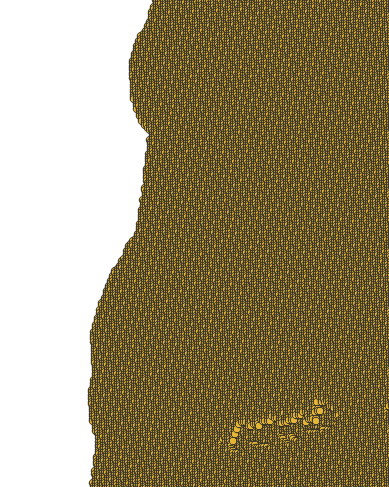
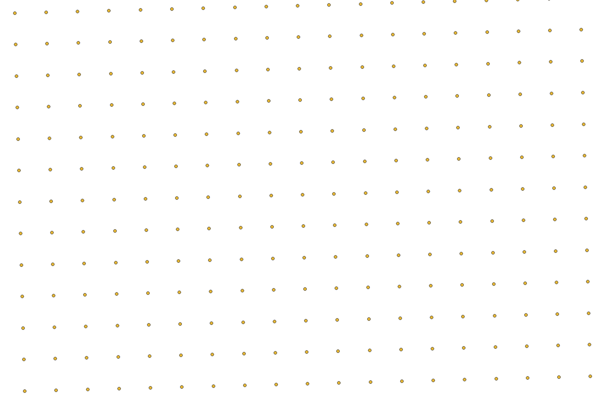
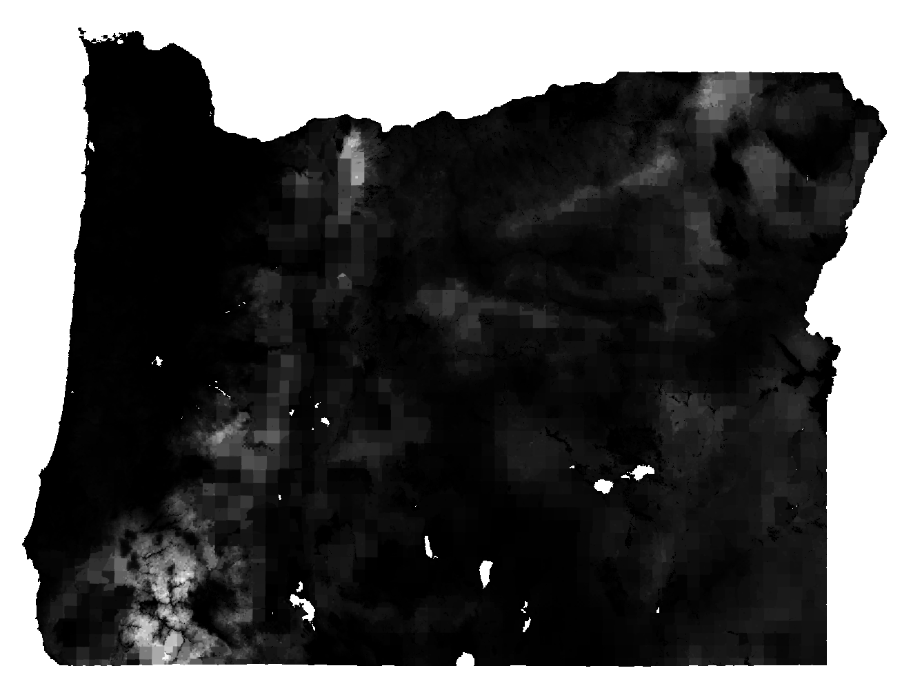
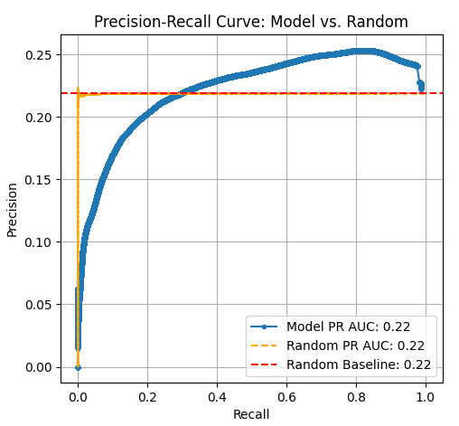
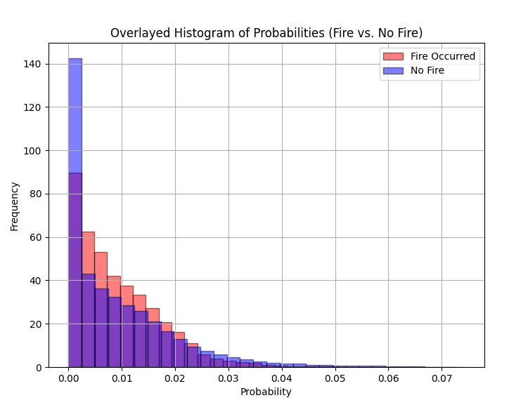
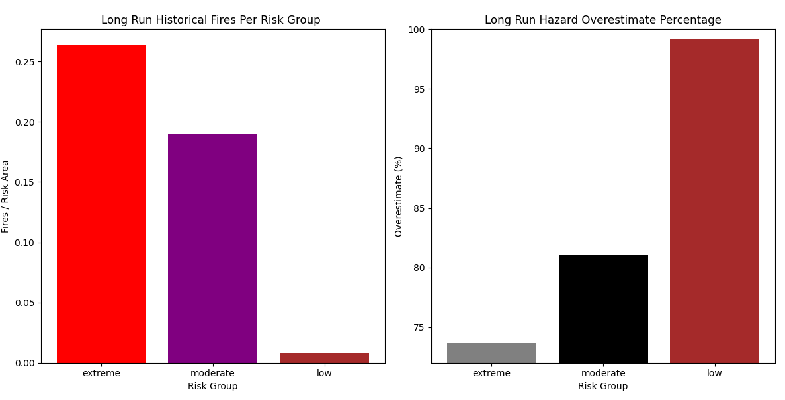
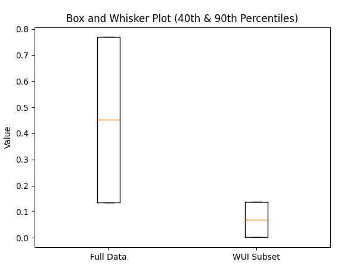

# Under Fire: Rethinking Wildfire Predictions

  

**A Critical Analysis of Oregon State's Wildfire Hazard Model**

  

*Examining the probabilities and performance in forecasting wildfire occurrences*

    
---
  

**Curated by:** Jeremy Kauwe  
**Date:** 2/5/2025

  

# **1. Executive Summary**

In public policy, models are expected to provide reliable, evidence-based insights that inform critical decisions. They must be rigorously validated and demonstrate predictive performance well above trivial baselines. It is unacceptable for a model—especially one that influences resource allocation and public safety—to perform on par with a random number generator.

Our long-run evaluation of **Oregon State's Wildfire Hazard Model**, using 21 years of wildfire data, reveals **critical failures that undermine its credibility as a predictive tool**:

- **Failure to Distinguish Fire and Non-Fire Zones:** A well-designed wildfire risk model should indicate that high-risk areas have historically experienced more fire than low-risk areas. However, this model does not meet that expectation. Instead, its classification performance is statistically indistinguishable from that of a random number generator, meaning it offers no meaningful ability to separate areas that have burned from those that have not.
- **Severe Overclassification of Risk:** The model’s hazard classification thresholds are misaligned with actual fire history. The high hazard threshold (0.13787), originally set at the 90th percentile within the wildland-urban interface (WUI), corresponds to the 40th percentile when applied to the full dataset. As a result, **nearly 60% of tax lots are classified as high hazard instead of the intended 10%, significantly inflating perceived wildfire risk.**
- **Inaccuracy in Probability Assignment:** The model systematically **overestimates wildfire likelihood by approximately 78%** over the long term. Within its highest risk category, extreme fire risk is overstated by 74%, further reinforcing a pattern of exaggerated predictions.

These findings raise serious questions about the validity of the methods used to develop and assess the model’s outputs. **For a tool intended to guide public policy, the expectation is clear: models must deliver actionable, robust, and clearly superior predictions—not results that mimic random chance.** Without fundamental improvements, the Oregon Wildfire Hazard Model risks misinforming decision-makers, misallocating resources, and eroding public trust in wildfire risk assessments.

# **2. Introduction**

Wildfire hazard assessment is a critical tool for land management, public policy, and disaster preparedness. These assessments rely on models designed to estimate the likelihood and potential impact of wildfires based on environmental conditions, historical data, and fire behavior simulations. A fundamental expectation of these models is their ability to accurately distinguish between areas historically prone to wildfires and those with little to no fire history.

A key component of wildfire risk assessments is **burn probability**, which is defined as the **average annual likelihood that a specific location will experience wildfire**. Burn probabilities are expressed as fractions, where a value of **0.01 represents a 1% chance of fire in any given year, or one expected fire every 100 years on average**. These probabilities are **long-term averages**, not short-term forecasts, and are used alongside fire intensity information to determine which landscapes are more likely to experience wildfire hazard.

However, **burn probability is only one part of the overall wildfire hazard model**. The final **wildfire hazard output** integrates burn probability with fire intensity modifiers and assigns risk classifications into three designated tiers:

- **High Wildfire Hazard**: Hazard value > 0.137872 (approximately the **90th percentile and above** of tax lot hazard values).
- **Moderate Wildfire Hazard**: Hazard value > 0.001911 and ≤ 0.137872 (approximately the **40th – 90th percentile**).
- **Low Wildfire Hazard**: Hazard value ≤ 0.001911 (approximately the **40th percentile and below**).

These hazard classifications were initially developed using hazard values near **structures within the Wildland-Urban Interface (WUI)**. Researchers combined burn probability with fire intensity at a **30 x 30-meter pixel scale**, averaged the values within a three-cell neighborhood, and extracted **792,949** hazard values associated with structures in the WUI. The hazard thresholds for **moderate** and **high** hazard zones were based on the **40th and 90th percentile** of these values, respectively. These thresholds were recommended for adoption by the **Rules Advisory Committee in February 2022** and later **formally adopted by the Board of Forestry in June 2022**.

## Purpose  
This report evaluates two critical aspects of the wildfire hazard model:

1. **Burn Probability’s Classification Performance** – Does the model’s burn probability output effectively distinguish between fire-prone and non-fire areas? A well-calibrated model should show that areas with high burn probability have historically experienced more fires than those with low burn probability.
2. **Final Wildfire Hazard Classification** – How well do the **low, moderate, and high hazard designations** align with actual fire history and risk expectations? If hazard tiers fail to correspond with real-world fire patterns, the model’s reliability for policy and mitigation efforts is called into question.

## Scope  
This analysis examines model outputs across the entire state of Oregon, assessing whether the wildfire hazard model meets the necessary standards for **accurate classification, predictive reliability, and policy relevance** in wildfire risk assessment.

# **3. Data** 

## Data Sources  

The data used in this analysis comes from multiple sources, including **model outputs from Oregon State University, historical wildfire occurrence records, and a transformed dataset created by overlapping these sources**. These datasets were obtained through **Oregon State’s Wildfire Hazard Risk Point of Contact (POC)** and serve as the foundation for evaluating both the **burn probability component** and the **final wildfire hazard classifications** of the wildfire hazard model.

## 1) Transformed Data (Final Combined Dataset)
This dataset is the result of integrating data from both the **Wildfire Hazard Model Data** and **Historical Fire Data**. It combines key elements necessary for evaluating the wildfire hazard model:

- **Burn Probability**: The probability of fire occurrence for each location, as assigned by the wildfire hazard model.
- **Wildfire Hazard Value**: A continuous variable representing the final hazard score, derived from burn probability and fire intensity.
- **Wildfire Hazard Classification**: A categorical variable designating each pixel as **low, moderate, or high hazard**, based on threshold values.
- **Burn Occurrence**: A binary indicator (**1 = fire occurred, 0 = no fire**) derived from historical wildfire records.

Each row in this dataset represents a **single pixel** where these four data sources overlap. The spatial resolution is **500 feet**, with each pixel spaced **500 feet apart both vertically and horizontally**, ensuring a uniform grid structure.

### Visualizing Data Granularity

To better illustrate the structure and granularity of the dataset, the following figures provide a zoomed-in visualization of the spatial data points. Each chart progressively zooms in to show how the dataset is structured at different levels of detail.

#### **Figure 1: Oregon Coast**

    

The first chart displays the entire dataset, highlighting the spatial distribution of data points across the region.

#### **Figure 2: Mid-Level Zoom**

    

This second chart provides a mid-level zoom, showing how individual data points become more distinguishable.

#### **Figure 3: High-Granularity Zoom**

    

The final chart provides a close-up of a **small section** of the dataset, emphasizing the **500-foot pixel resolution** and illustrating the spatial density of the points.

These figures help to contextualize the dataset, ensuring that readers understand the **scale** and **resolution** of the data being analyzed.

### Dataset Structure
This analysis focuses on a **subset** of the transformed dataset to examine **burn probability distributions, fire occurrence patterns, and final wildfire hazard classifications**.

- **Burn Probability**
  - Represents the probability of a fire occurring in a given pixel.
  - Used to assess whether burn probability aligns with actual fire history.

- **Wildfire Hazard Value**
  - A continuous variable representing the **final model output**, incorporating both burn probability and fire intensity.
  - Used to classify pixels into one of three hazard categories.

- **Wildfire Hazard Classification**
  - A categorical variable representing the final assigned wildfire risk tier:
    - **High Hazard** (hazard value > 0.137872)
    - **Moderate Hazard** (hazard value > 0.001911 and ≤ 0.137872)
    - **Low Hazard** (hazard value ≤ 0.001911)
  - Evaluated to determine whether hazard classifications accurately reflect fire-prone areas.

- **Fire Occurrence Flag**
  - A **binary classification variable** indicating whether a fire has historically occurred in that pixel (**1 = fire, 0 = no fire**).

By analyzing this dataset, we assess whether **burn probability effectively distinguishes between fire-prone and non-fire areas** and whether the **final wildfire hazard classifications** correspond to actual fire history.

---

## 2) Wildfire Hazard Model Data
This dataset, provided by **Oregon State University (OSU)**, was used to build the wildfire hazard model. It contains **burn probability outputs** and the **final wildfire hazard values**, which were extracted for analysis.

- **Data Source**: Oregon State University

- **Path to Final Burn Probabilities**:  
  `SB80PublicData >> FireModelingData >> FireModeling_FuelscapeData.gdb >> BurnProbability`

- **Path to Wildfire Hazards**:  
  `SB80PublicData >> FireModelingData >> FireModeling_FuelscapeData.gdb >> WildfireHazard`

This dataset provides both the **raw burn probability values** and the **final hazard classifications**, which were later overlaid with historical fire records to evaluate their predictive accuracy.

---

## 3) Historical Fire Data
This dataset, provided by **Oregon State University (OSU)**, contains **recorded wildfire events from 2000 to 2021** and was used to validate the model’s predictive accuracy.

- **Data Source**: Oregon State University
- **Inclusion Criteria**:
  - Only fire events where **acres burned exceeded 247** were included to ensure that only significant fire occurrences were considered.
  - **Prescribed burns and resource management fires were excluded** to maintain focus on naturally occurring and uncontrolled wildfire events.

This dataset was overlaid with the **Wildfire Hazard Model Data** to create the **Transformed Dataset**, allowing an evaluation of whether **burn probability aligns with historical fire occurrence patterns** and whether **hazard classifications correspond to actual wildfire risk**.

A full list of dataset links and additional details can be found in the **[GitHub README](https://github.com/yourusername/wildfire-risk-analysis/blob/main/README.md)**. For further information or verification, inquiries can be directed to **OSUwildfirerisk@oregonstate.edu**.

  ## Wildfire Burn Probability Map  
  The chart represents probability values using a grayscale gradient, where lower probabilities are darker (black) and higher probabilities are lighter (white).

  ### Color Mapping:
  - **Black (0.000000 probability)**: Represents the lowest probability.
  - **White (0.072378 probability)**: Represents the highest probability.
  - **Gradient Transition**: Intermediate probabilities transition from black to white.

  ### Interpretation:
  - **Darker Regions (Near Black)**: Indicate areas with **low probability**.
  - **Lighter Regions (Near White)**: Indicate areas with **high probability**.
  - **Gradual Shading**: Helps visualize the probability distribution smoothly.

  ### Purpose:
  - The grayscale mapping **enhances visibility** of probability changes.
  - It provides a **clear, intuitive** representation without requiring numerical labels.

### Wildfire Hazard Map Description

The wildfire hazard map uses a **grayscale gradient** to represent hazard values, where **lower hazard areas appear darker (black) and higher hazard areas appear lighter (white).** This visualization helps distinguish varying levels of wildfire hazard based on model outputs.

#### **Color Mapping**
- **Black (0.00 hazard value)** → Represents the **lowest** wildfire hazard.
- **White (5.48 hazard value)** → Represents the **highest** wildfire hazard.
- **Gradient Transition** → Intermediate hazard values **transition smoothly** from black to white.

#### **Interpretation**
- **Darker Regions (Near Black, Hazard Value Close to 0.00)**
  - Indicate **low wildfire hazard** areas.
  - These areas are expected to have **minimal fire risk** based on the model’s calculations.
- **Lighter Regions (Near White, Hazard Value Close to 5.48)**
  - Indicate **high wildfire hazard** areas.
  - These areas are **more prone to fire risk** according to the hazard model.
- **Gradual Shading**
  - Helps visualize how hazard values **change across different locations**.
  - Allows for **smooth interpretation** without needing explicit numerical labels.

#### **Purpose**
- The **grayscale mapping visually enhances hazard level variations** across the region.
- Helps **quickly identify high-risk areas** based on modeled hazard values.
- Provides an **intuitive, easily interpretable representation** of wildfire hazard zones.

The hazard map above provides a visual representation of wildfire risk levels across the study area, highlighting **low to high hazard zones** using grayscale intensity.

## Burn Probability Overlaid with Historical Fire Data  
This map overlays the model’s burn probability layer with historical fire occurrences (2000-2021), highlighting areas where the model predicted fire risk versus actual fire events.  The gradient color is just to make it more visually appealing

### Loading and Processing the Data

This section outlines the **data preparation steps** used to construct the final dataset for analysis.

#### **Loading the Data**
1. **Load the Burn Probability Layer** into QGIS.
2. **Load the Wildfire Hazard Layer** into QGIS.
3. **Load the Historical Fire Occurrence Dataset** into QGIS.

#### **Ensuring a Consistent Coordinate Reference System (CRS)**
- All three datasets were checked to confirm they used the **same CRS** to maintain spatial accuracy and alignment.

#### **Fixing Overlapping Fire Data**
- Some fire records **overlapped**, causing multiple entries for the same area.
- To correct this, **overlapping fires were merged** into a single fire occurrence per affected pixel.
- The merged fire was treated as **one fire event** rather than multiple fires in the same location.

#### **Creating a Grid of Points**
- A **grid of points** was generated, with each point spaced **500 feet apart** both vertically and horizontally across Oregon.
- This ensured **consistent spatial sampling** across the study area.

#### **Extracting Burn Probability, Wildfire Hazard, and Fire Occurrence**
For each **grid point**, the following values were extracted:
- **Burn Probability Value** from the model output.
- **Wildfire Hazard Value** from the model output.
- **Fire Occurrence Flag** assigned based on historical wildfire data:
  - `1` if a fire was recorded at that location (after merging overlapping fires).
  - `0` if no fire was recorded.

#### **Handling Null Values**
- Some fires extended beyond Oregon’s boundaries, **resulting in missing burn probability values**.
- These **null values were removed** to ensure clean and complete data.
- **Null hazard values were dropped**, ensuring only valid data was included.
- **Non-fire areas were explicitly set to `0`** for fire occurrence.

#### **Exporting the Final Dataset**
- The cleaned **grid layer** was **saved and exported as a CSV file**.
- This **CSV file**, referred to as the **Transformed Data**, is included in the ZIP file linked in the README.

#### **Creating Columns Based on Risk Classification**
Wildfire hazard values were categorized into **three risk bands**:
- **High Hazard**: Hazard value **> 0.137872**
- **Moderate Hazard**: Hazard value **> 0.001911 and ≤ 0.137872**
- **Low Hazard**: Hazard value **≤ 0.001911**

---
# **4. Methodology**

To evaluate how well the model predicts fire occurrences, we conducted several tests. These tests help determine whether the model provides meaningful predictions or if its results are no better than random guessing. Below, we explain these tests in simple terms and why they matter.

---

## **1. Evaluating Model Performance**

Predicting fire occurrences requires a balance between two key factors: **precision and recall**. Additionally, we use the **Precision-Recall Curve and its Area Under the Curve (PR-AUC)** to assess the model’s overall effectiveness.

### **1.1 Precision and Recall**
When predicting fire occurrences, we measure how well the model identifies fire-prone areas using two key metrics:

- **Precision (How many predicted fires were correct?)**  
  - If the model predicts **100 locations** where fire will occur and **60 of them actually had a fire**, the precision is **60%**.
  - **Higher precision** means fewer false alarms (incorrect fire predictions).

- **Recall (How many actual fires did the model catch?)**  
  - If there were **100 actual fire locations** and the model correctly identified **60 of them**, the recall is **60%**.
  - **Higher recall** means fewer missed fires.

These two measures often **trade off** against each other.  
- If the model is **too aggressive**, it catches **all** real fires but **creates many false alarms** (low precision, high recall).  
- If the model is **too cautious**, it avoids false alarms but **misses many real fires** (high precision, low recall).  

We need a **balance**, which leads us to the **Precision-Recall Curve**.

### **1.2 Precision-Recall Curve and AUC Calculation**
Since precision and recall change depending on the model’s cut off, we plot a **Precision-Recall Curve** to analyze its performance across different thresholds.

- The model assigns a **probability score** (e.g., 0.02, 0.08, 0.15, etc.) to each location, estimating the likelihood of fire occurring.
- We **vary the threshold** (the cutoff point for deciding what counts as a "fire prediction") and calculate precision and recall at **each threshold**.
- These precision-recall points are **plotted on a graph**, forming the **Precision-Recall Curve**.
- The **AUC (Area Under the Curve)** is then calculated by measuring the total area beneath this curve, representing the **average performance** of the model across all confidence levels.

### **1.3 Interpreting PR-AUC and Industry Standards**
Since PR-AUC is particularly useful for **imbalanced datasets**, it is important to compare model performance to known industry standards:

#### **Industry Benchmarks**
- **0.2 – 0.4** → Slightly better than random guessing but still weak.
- **0.4 – 0.6** → Moderate predictive power; some meaningful patterns detected.
- **0.6 – 0.8** → Good performance; the model is effective in distinguishing fire-prone areas.
- **0.8 and above** → Strong predictive ability; highly reliable for decision-making.

#### **Baseline (Random Model)**
- A **random model** will have a PR-AUC equal to the proportion of fire occurrences in the dataset.  
- If **21.55% of the data represents fire occurrences**, a random classifier would achieve a PR-AUC of **0.2155**.
- If the model’s PR-AUC is **above 0.2155**, it is **better than random** and can help identify fire-prone areas.
- If it is **close to 0.2155**, it is **not useful** because it performs similarly to random guessing.
- If it is **below 0.2155**, the model is misleading and should not be used.

---

### **1.4 Comparing to a Random Model**
To test whether the model is **actually predicting fires or just guessing**, we compared it to a **random number generator** that assigns probabilities at random.

- If the model **performs better than random**, it means it has **some ability to identify fire-prone areas**.
- If the model **performs similarly to random**, it means the predictions **aren’t useful for decision-making**.
- This comparison ensures that the model has **actual predictive power** rather than just appearing to perform well by coincidence.

---

## **2. Visual Analysis: Histogram Layover**
To further evaluate the model, we **compared the histograms of predicted probabilities** for locations where fires occurred and where they did not.

- If the fire liklihood can distinguish between fire and non-fire zones then there should be clear seperation of probabilities when overlapping the histogram of historical fire and non-fire probability outputs.
- Significant probability overlap indicates the model cannot distinguish between fire and non fire zones.

This **histogram analysis** helps determine if the model provides meaningful insights or if it fails to separate fire-prone areas from non-fire areas.

---

## **3. Measuring Overestimation (False Alarms and Risk Inflation)**

To quantify how much the model **overestimates fire risk**, we calculate the **overestimation rate**, which represents the proportion of predicted fires that **never actually occurred**.

### **Overestimation Rate Formula**

$$
\text{Overestimation Rate} = \frac{\text{False Positives (FP)}}{\text{True Positives (TP)} + \text{False Positives (FP)}}
$$

This value represents the **percentage of predicted fires that did not happen**.

Since **Precision** is defined as: 

$$
\text{Precision} = \frac{\text{True Positives (TP)}}{\text{True Positives (TP)} + \text{False Positives (FP)}}
$$

We can equivalently express overestimation as:

$$
\text{Overestimation Rate} = 1 - \text{Precision}
$$

This shows that **as precision improves, the overestimation rate decreases**, meaning fewer false alarms.

### **Algebraic Proof: Overestimation Rate = 1 - Precision**
We start with the definition of **Precision**:

$$
\text{Precision} = \frac{\text{True Positives (TP)}}{\text{True Positives (TP)} + \text{False Positives (FP)}}
$$

Now, subtract **Precision** from 1:

$$
1 - \text{Precision} = 1 - \frac{\text{TP}}{\text{TP} + \text{FP}}
$$

Express **1** as a fraction with the same denominator:

$$
1 - \text{Precision} = \frac{\text{TP} + \text{FP}}{\text{TP} + \text{FP}} - \frac{\text{TP}}{\text{TP} + \text{FP}}
$$

Since both terms have the same denominator, we subtract the numerators:

$$
1 - \text{Precision} = \frac{(\text{TP} + \text{FP}) - \text{TP}}{\text{TP} + \text{FP}}
$$

Simplify the numerator:

$$
1 - \text{Precision} = \frac{\text{FP}}{\text{TP} + \text{FP}}
$$

But this is **exactly** the formula for the **Overestimation Rate**:

$$
\text{Overestimation Rate} = \frac{\text{False Positives (FP)}}{\text{True Positives (TP)} + \text{False Positives (FP)}}
$$

Thus, we have proved:

$$
1 - \text{Precision} = \text{Overestimation Rate}
$$

### **How to Interpret Overestimation**
- **High Overestimation Rate** → The model **predicts too many fires that never occur**, inflating fire risk.
- **Low Overestimation Rate** → The model is **more conservative** but may **fail to predict actual fires**.
- The **overestimation percentage** quantifies how much the model **overstates fire risk compared to actual fire occurrences**.

By measuring overestimation, we assess whether the model **exaggerates wildfire likelihood**, ensuring its predictions are **accurate and not misleading**.

## **4. Normalizing Fire Occurrence at the Pixel Level**

To assess wildfire risk across different hazard bands, we normalize the **number of pixels that experienced fire** by the **total number of pixels** within each risk band. This provides a measure of **fire occurrence per pixel**, allowing for a standardized comparison across hazard classifications.

#### **Formula for Fire Occurrence per Pixel**

$$
\text{Relative Risk} = \frac{\text{Number of Pixels That Experienced Fire in Risk Band}}{\text{Total Pixels in Risk Band}}
$$

- This represents the **fire occurrence rate per pixel** within each hazard band.
- It provides a way to compare **fire likelihood per unit of classified area**.

#### **Overestimation of Hazard Risk**
Since the hazard model predicts that higher risk bands should experience more fires, we measure **overestimation** as:

$$
\text{Overestimation of Hazard Risk} = 1 - \text{Relative Risk}
$$

- This quantifies **how much the model overstates fire occurrence** compared to actual fire data.

By applying this method, we create a **standardized metric** to evaluate whether the model **realistically reflects wildfire occurrence** across different hazard classifications.

## **5: Threshold Comparison and Percentile Interpretation**  

A percentile represents the relative standing of a value within a dataset, indicating the percentage of data points that fall below it. For example, a value at the 90th percentile means that 90% of the data falls below it, while a value at the 40th percentile means only 40% of the data falls below it. In a well-calibrated model, the hazard thresholds derived from the full dataset should align closely with those established using the WUI subset. If these thresholds differ significantly—such as the high hazard threshold corresponding to the 90th percentile in the WUI subset but only the 40th percentile in the full dataset—it suggests a misalignment in how hazard values are distributed across different data groupings. Ideally, a properly functioning model should produce similar thresholds regardless of whether they are derived from the WUI subset or the full dataset, ensuring consistency in hazard classification.

---

### **Why This Matters**
- **A high PR-AUC** means the model is **better than random guessing** and can help identify fire-prone areas.  
- **Understanding precision and recall** helps determine whether the model is prone to **false alarms or missed fires**.  
- **The PR-AUC score reflects the model’s overall ability** to distinguish fire-prone areas, rather than relying on a single threshold.  
- **Comparing to the baseline (random model)** ensures we are measuring true predictive power rather than overfitting.  
- **Histogram analysis provides a visual check** on whether predicted probabilities actually differentiate fire-prone and non-fire areas.  
- **The overestimation analysis ensures** that the model is not **artificially inflating fire risk** by predicting too many false fires.  

# **5. Results & Analysis**

## Understanding the Evaluation Process  
The **burn probability model** is designed to classify areas based on the likelihood of fire occurrence. Since our goal is to assess how well it differentiates between fire and no-fire events, we evaluate it as a **classification model**.

A key challenge in this analysis is the **imbalance in the dataset**, where **fire events are much rarer than no-fire events**:

- **No Fire (0): 78.11% of pixels**  
- **Fire Occurred (1): 21.89% of pixels**  

For imbalanced datasets, standard metrics like **accuracy can be misleading**, since a model could predict **"No Fire" for all pixels and still achieve high accuracy**. Instead, we focus on **Precision-Recall AUC (PR AUC)** because:

- **PR AUC is a better metric for imbalanced datasets**, as it evaluates the trade-off between detecting fires (**recall**) and avoiding false positives (**precision**).
- **A high PR AUC indicates that a model successfully distinguishes fire vs. no-fire events**, while a low PR AUC suggests that the model lacks predictive power.

---

## Performance of the Burn Probability Model  
To evaluate the **Burn Probability Model (OSU’s model)**, we compute the **Precision-Recall AUC (PR AUC)** score on the probability output from the model trimming off the first and last datapoints.

- **PR AUC of OSU’s Model** = **0.22**
- **AUC Interpretation**: Higher values indicate better classification performance.

To understand whether the model is **better than random guessing**, we compare its performance to a **random probability generator**.

---

## Benchmarking Against Random Predictions  
When a classification model **performs no better than random**, its performance simply reflects the balance of the dataset. Since **fires occur in 21.89% of the dataset**, a completely **random model’s PR AUC should be approximately 0.22**.

To determine if the **OSU burn probability model provides meaningful classification**, we generate **random probabilities** and calculate the **PR AUC** for these random scores.

- **PR AUC of a Random Model** = **0.22**
- **Since the OSU model's PR AUC is identical to the random classifier (0.22), it provides no meaningful predictive power.**

To validate this comparison, we:
1. **Generate random probabilities** sampled from a uniform distribution between 0 and 1.
2. **Compute PR AUC** for these random probabilities.
3. **Compare the OSU model’s PR AUC to this random baseline**.

If both values are similar, then the OSU model **is functionally random and does not improve fire risk classification**.

### **Performance Comparison Chart**
| Model                     | PR AUC Score |
|---------------------------|-------------|
| **OSU Burn Probability Model** | **0.22** |
| **Random Probability Model**   | **0.22** |

This confirms that the **burn probability model does not provide any additional value over a purely random model**.

  

### Interpreting the Results  

The Precision-Recall AUC comparison shows that the **Burn Probability Model does not meaningfully distinguish fire from non-fire events**.  

- Since the **OSU model’s PR AUC is equal to the PR AUC of a random classifier (0.22)**, it is **no better than guessing**.  
- A useful model should have a **significantly higher PR AUC**, demonstrating that it can **correctly separate fire-prone and non-fire areas**.  
- The fact that both models perform identically indicates that **the OSU model adds no predictive value** to fire risk classification.  

These results indicate that the **Burn Probability Model does not provide actionable fire risk predictions**. If a model’s **classification power is no better than random**, then its outputs **cannot be relied upon for decision-making**.

---
## Histogram Overlap of Burn Probabilities  

### **Understanding the Burn Probability Histograms**  

The histograms display the **distribution of burn probabilities** assigned by the OSU model for two different classes:  
- **Fire Pixels** → Locations where actual wildfires occurred.  
- **No-Fire Pixels** → Locations where no wildfire was recorded.  

Each pixel in the dataset is assigned a **burn probability** between **0 and 1**, indicating how likely the model believes a fire will occur at that location. If the model is performing well, there should be clear seperation of the probabilities.

---

### **Why Overlapping Should Show Separation Between Classes**  

In a well-calibrated classification model, burn probabilities should serve as a **meaningful decision boundary** between fire-prone and safe areas. That means:  
- Fire-prone areas should have **higher burn probabilities**, forming a **distribution shifted to the right**.  
- No-fire areas should have **lower burn probabilities**, forming a **distribution shifted to the left**.  

When visualized in a **histogram**, this would appear as two distributions with **minimal overlap**, clearly distinguishing high-risk areas from low-risk areas.

---

### **Histogram Comparison of Burn Probabilities**  

The histogram below overlays the **burn probability distributions** for both fire and no-fire pixels.

  

---

### **Interpreting the Results**  

A well-performing model should **assign significantly different burn probabilities to fire and no-fire locations**, resulting in two distinct histogram distributions.

However, in this case:  
- **The fire and no-fire distributions overlap significantly**, meaning the model **fails to meaningfully separate fire-prone areas** from non-fire areas.  
- **The burn probabilities are not predictive of actual fire occurrence** and appear to be assigned randomly.  

Since the **burn probability distributions for fire and no-fire pixels are nearly identical**, this confirms that:  
- **The model does not successfully differentiate between high-risk and low-risk areas.**  
- **The models burn probabilities are not useful for decision-making in wildfire risk assessment.**  
- **This supports the PR AUC findings, which showed that the model performs no better than random guessing.**  

These results strongly suggest that the **burn probability model is not a reliable tool for wildfire risk assessment**.

---

## Overestimation of Fire Risk Predictions  

### **Determining the Classification Threshold**  

Since the burn probability model provides **continuous probability estimates**, we must set a **threshold** to classify whether a fire is predicted to occur.  

We selected the **threshold where precision was at its maximum for the PR AUC curve** designating all probabilities above and equal to this as fire and all probabilities below as non-fire.  We choose this because precision appears to peak around the baseline and stay there.  
- Selected Threshold: **`0.001810912741348`**  
- Precision at selected threshold: **`0.2534851761282108`**  

At this threshold, the model classifies fire risk as follows:

  
| Metric | Value |
|--------|--------|
| **True Negatives (TN)** | `2,963,665` |
| **True Positives (TP)** | `2,132,259` |
| **False Positives (FP)** | `6,279,511` |
| **False Negatives (FN)** | `458,360` |
| **Precision** | `0.2534851761282108` |
| **Recall** | ` 0.823069312778143` |

---

### **Overprediction Rate and Model Performance**  

One of the most concerning findings is the **high rate of false positives**, leading to an **overestimation of fire risk**.  

We calculate the **Overprediction Rate** as:

$$
\text{Overprediction Rate} = \frac{\text{False Positives (FP)}}{\text{False Positives (FP)} + \text{True Positives (TP)}}
$$

At the selected threshold:  
- **False Positives (FP):** `6,279,511` 
- **True Positives (TP):** `2,132,259` 
- **Overprediction Rate:** `74.65%`  

This means that over the long run (21 years of data) **nearly 75% of areas classified as high fire risk did not actually experience a fire**.

---

### **Interpreting the Results**  

The model’s **severe overestimation** of wildfire risk has **direct consequences** that affect both **resource allocation and public trust**.

### **1. Misallocation of Resources**  
- **Fire management resources may be deployed inefficiently**, focusing on areas that are not actually at risk.  
- Firefighters and emergency responders may be directed **away from actual fire-prone areas**, increasing the risk of uncontrolled wildfires in critical regions.  
- Public funds may be **misallocated**, prioritizing fuel reduction efforts and fire mitigation strategies in areas with little actual wildfire threat.

### **2. Loss of Public Trust in Wildfire Models**  
- If **false alarms become frequent**, landowners, policymakers, and the public may **lose confidence in wildfire risk assessments**.  
- Communities may **ignore future warnings**, assuming fire risk predictions are unreliable.  
- Overuse of exaggerated hazard maps may create **fire fatigue**, where stakeholders no longer react to critical fire danger warnings.

### **3. Overstating Actual Wildfire Hazard Risk**  
- A **75.65% overestimation rate** inflates perceived wildfire hazard, **misrepresenting true fire danger**.  
- Fire insurance policies and land management decisions may be **negatively impacted by excessive risk classifications**.  
- Public policy decisions that rely on this model may be **based on inaccurate, overly cautious fire risk assessments** rather than actual fire-prone conditions.

## **Overestimation of Hazard**  

To assess the degree of overestimation in the wildfire hazard classifications, we compute the **relative risk** for each hazard band—**extreme, moderate, and low**. The relative risk is defined as the proportion of pixels within a given hazard band that have experienced fire over the 21-year study period:

$$
\text{Relative Risk} = \frac{\text{Pixels Experiencing Fire}}{\text{Total Pixels in Hazard Band}}
$$

A well-calibrated model should produce relative risks that closely match the expected hazard levels. However, if a hazard classification systematically overstates fire probability, this will be evident in a large discrepancy between the assigned hazard category and the actual historical fire occurrence.  

To quantify overestimation, we compute:

$$
\text{Overestimation} = 1 - \text{Relative Risk}
$$

where values closer to **1** indicate a high degree of overprediction (i.e., many pixels are classified as high hazard despite rarely experiencing fire).  

### **Long-Term Overestimation Across Hazard Bands**
The results over the **21-year dataset** reveal a consistent pattern of overestimation across all hazard bands:

- **Extreme Hazard Band:** Overestimation is **74%**, indicating that only about **26%** of pixels classified as extreme hazard have actually burned.  
- **Moderate Hazard Band:** Overestimation is **81%**, meaning that just **19%** of pixels in this category have experienced fire.  
- **Low Hazard Band:** Overestimation is **98%**, showing that nearly all pixels classified as low hazard have not burned, highlighting significant misclassification.  

These findings suggest that **wildfire risk is persistently overstated**, especially in areas labeled as "extreme hazard." This long-run analysis raises concerns about the accuracy of hazard classifications and their implications for policy and resource allocation.  

### **Visualization of Overestimation**  
The figure below illustrates the distribution of actual fire occurrences across different hazard bands, visually demonstrating the overestimation trend.  

  

### **Interpretation of Results**  

- **Significant Overestimation:** The model overstates wildfire risk by **74% in extreme**, **81% in moderate**, and **98% in low hazard areas**, indicating systematic overprediction.  
- **Weak Separation Between Hazard Tiers:** While the **low-to-moderate jump** shows a clear increase in fire occurrence, the **moderate-to-extreme transition** lacks a comparable increase, suggesting poor differentiation at higher risk levels.  
- **Thresholds for Preventative Measures:** OSU’s wildfire hazard map classifies **high-risk properties in the WUI as requiring defensible space and home hardening**, yet the thresholds used may not align with actual fire frequency.  

The results indicate that **fire risk classification is highly inflated**, particularly in extreme hazard zones, where fire occurrence is only marginally higher than in moderate zones. A well-calibrated model should show clear **progression in risk between tiers**, yet the lack of separation suggests that hazard bands may not accurately reflect true fire probabilities. Future adjustments to risk thresholds should ensure that each tier corresponds to a **meaningful increase in fire occurrence**, avoiding unnecessary overclassification that could misallocate resources and policy efforts.  

## **Comparison of WUI Subset to Full Dataset**  

The wildfire hazard model assumes that areas within the **Wildland-Urban Interface (WUI)** are the most hazardous due to their proximity to human development and fire-prone landscapes. If this assumption holds, hazard scores in the WUI should generally be higher than those in the full dataset, but the percentile thresholds used for classification should remain relatively stable when applied beyond the WUI subset. Comparing the **40th and 90th percentiles**—which were explicitly used to define hazard categories—allows us to test whether these thresholds scale appropriately across datasets.  

The comparison reveals a **significant misalignment**:  
- The **90th percentile** in the WUI subset aligns with only the **40th percentile** in the full dataset.  
- This means that hazard thresholds set using the WUI subset **overclassify risk** when applied to the full dataset, leading to a much larger proportion of pixels being placed in high-risk categories than originally intended.

  

### **Interpretation of Results**  
These findings indicate that **hazard classifications based on the WUI subset may not generalize well** to broader landscapes. A well-calibrated model should maintain stable thresholds across different datasets, ensuring that hazard classifications retain their intended meaning. The fact that the **full dataset’s 40th percentile aligns with the WUI subset’s 90th percentile** suggests that the threshold selection process led to **substantial overclassification of wildfire risk** when applied statewide.  

---

# **6. Discussion and Implications**  

Wildfire risk models are intended to provide **actionable, data-driven insights** that guide public policy, emergency planning, and resource allocation. Their credibility depends on their ability to produce **meaningful predictions that separate fire-prone areas from those unlikely to burn**. However, this evaluation of the **Oregon Wildfire Hazard Model** highlights fundamental shortcomings, including **overclassification, weak hazard differentiation, threshold misalignment, and poor long-term predictive performance**.  

## **Overclassification and Risk Inflation**  
A primary concern is the **significant inflation of fire risk classifications**. The model assigns **high hazard labels to nearly 60% of tax lots**, even though the original intent was to classify only the highest-risk 10%. This misalignment stems from the fact that the **90th percentile in the WUI subset corresponds only to the 40th percentile in the full dataset**, meaning hazard scores do not scale as expected when applied statewide.  

Beyond classification issues, the model **routinely overestimates the probability of fire occurrence**. Across all hazard categories, the model overpredicts fire risk by **78% in the long term**, with **extreme hazard areas overstated by 74%**. These inflated estimates could lead to **unwarranted fire mitigation requirements** for property owners and **misallocation of state and federal resources**.  

## **Failure to Distinguish Between Fire and Non-Fire Zones**  
One of the most concerning findings is that **the model does not effectively separate areas that have historically burned from those that have not**. Over a **21-year period**, the model’s predictions are **statistically indistinguishable from random chance**—meaning that a pixel classified as high hazard is no more likely to experience fire than one classified as low hazard.  

Theoretically, this model **should perform well on this long-term analysis**, as it was **trained using the same historical fire data** according to OSU’s point of contact. The fact that it fails to differentiate between fire-prone and non-fire areas suggests **serious flaws in the modeling process or the assumptions behind its risk classifications**. A well-calibrated model should **show a strong relationship between hazard classifications and actual fire history**, yet this analysis demonstrates that **fire occurrence is poorly correlated with assigned risk scores**. If hazard scores fail to differentiate between fire-prone and fire-free areas over time, the model cannot be relied upon to guide **mitigation planning, land-use decisions, or emergency preparedness strategies**.  

## **Weak Differentiation Between Hazard Tiers**  
For a hazard model to be useful, it must clearly distinguish between **low, moderate, and extreme** risk areas. This evaluation demonstrates that **the difference in fire occurrence between moderate and extreme hazard zones is minimal**, suggesting that the model does not effectively scale risk levels. While there is a clear increase in fire occurrence when moving from **low to moderate hazard zones**, the transition from **moderate to extreme hazard** is far less pronounced, **calling into question the value of the extreme hazard classification**.  

## **Threshold Misalignment and Generalization Issues**  
The model’s hazard classifications were developed using **the WUI subset**, under the assumption that **these areas represent the highest fire risk**. However, the analysis shows that **hazard thresholds derived from the WUI do not translate well to the full dataset**. If the WUI truly represented the most fire-prone areas, the hazard scores within it should be **consistently higher** than in the full dataset, yet this comparison reveals that **the risk scores in the WUI subset are not meaningfully different** from those assigned across the broader landscape.  

## **Economic and Property Market Implications**  
Beyond its impact on **policy and fire management strategies**, the model’s poor performance could have **significant economic consequences**. Fire hazard classifications **directly influence property values, mortgage eligibility, insurance premiums, and a homeowner’s ability to sell their property**.  

- **Depressed Property Values:** If a model **misclassifies a large percentage of properties as high risk**, it could lead to **decreased property values**, as buyers and lenders may perceive these areas as unsafe. This could **negatively impact home equity and personal wealth** for property owners.  
- **Difficulty Selling a Home:** Properties classified as high hazard may face **reduced buyer interest**, as potential homeowners may struggle to secure financing or be forced to pay significantly higher insurance rates. This could lead to **longer time on the market and financial losses for sellers**.  
- **Increased Costs for Homeowners:** Homeowners in **falsely classified high-risk areas** may be required to **spend unnecessary money on fire mitigation efforts**, such as **defensible space, home hardening, and vegetation removal**, even if their actual fire risk is low.  
- **Tax Revenue Losses:** If widespread overclassification results in **lower property values**, this could **reduce taxable property assessments**, ultimately **decreasing tax revenue for local and state governments**. These reductions could impact funding for **public services, infrastructure, and emergency response capabilities**, further exacerbating the challenges of wildfire mitigation.  

The reliance on a model that **fails to perform better than a random number generator** introduces **unnecessary economic and policy risks**. By producing inaccurate hazard classifications, the model could **cause financial harm to homeowners and communities, while providing no meaningful benefit in terms of fire risk mitigation**. Without a model that reliably distinguishes **fire-prone areas from low-risk zones**, decision-makers risk **enacting policies that do more harm than good**.  

---

# **7. Conclusion**  

This evaluation of the **Oregon Wildfire Hazard Model** reveals fundamental flaws in its ability to accurately classify fire risk, raising serious concerns about its reliability as a predictive tool. Over a **21-year period**, the model **systematically overestimated wildfire probability**, misclassified a **disproportionate number of properties as high hazard**, and **failed to distinguish between fire-prone and non-fire areas** better than random chance. A well-calibrated model should demonstrate **a clear relationship between hazard classifications and actual fire occurrence**, yet this analysis shows that **risk scores do not meaningfully correspond to fire history**, undermining the model’s utility in guiding fire mitigation efforts.  

Compounding these performance issues are questions regarding **how hazard classification thresholds were determined**. The decision to establish risk bands by **voting on the 90th and 40th percentiles of a subset dataset** introduces **a level of subjectivity that is difficult to justify in a model expected to inform public policy**. If hazard classifications are based on thresholds that **lack empirical validation or fail to generalize to the full dataset**, the model cannot be expected to produce meaningful or reliable outputs. The fact that these thresholds, once applied more broadly, **result in a drastic overclassification of high-risk areas** suggests that the initial methodology was flawed.  

The consequences of these failures extend beyond **policy and emergency planning**—they have **direct economic and social impacts**. Homeowners may be required to **spend unnecessary money on fire mitigation efforts** due to inflated hazard classifications, while misclassifications could lead to **declining property values, difficulty selling homes, and reduced tax revenue** for local governments. If **hazard classifications do not reflect actual wildfire risk**, public trust in fire management policies may erode, making it harder to implement **effective prevention strategies**.  

Ultimately, this analysis highlights the **critical need for empirical validation** in wildfire risk modeling. A model intended to **inform public policy, insurance rates, and land-use regulations** must provide **clear, evidence-based classifications** that align with **historical fire data**. Without substantial improvements in **hazard classification thresholds, probability calibration, and fire occurrence prediction**, this model risks misinforming decision-makers, misallocating resources, and creating unnecessary financial and regulatory burdens for communities.  

# **8. References**

### Machine Learning & Model Evaluation

1. **Precision and Recall Definitions**  
   - Google Developers Machine Learning Crash Course:  
     [Classification: Accuracy, Precision, Recall](https://developers.google.com/machine-learning/crash-course/classification/accuracy-precision-recall)

2. **Industry Standards for PR-AUC in Imbalanced Datasets**  
   - Aporia Machine Learning Guide:  
     [Ultimate Guide to PR-AUC: Calculations, Uses, and Limitations](https://www.aporia.com/learn/ultimate-guide-to-precision-recall-auc-understanding-calculating-using-pr-auc-in-ml/)  
   - Deepchecks Blog:  
     [Understanding F1 Score, Accuracy, ROC-AUC & PR-AUC Metrics](https://www.deepchecks.com/f1-score-accuracy-roc-auc-and-pr-auc-metrics-for-models/)

3. **Overestimation Rate Calculation**  
   - Sin-Yi Chou's Data Science Blog:  
     [Compute the AUC of Precision-Recall Curve](https://sinyi-chou.github.io/python-sklearn-precision-recall/)

4. **Comparison to a Random Model**  
   - Arize AI Blog:  
     [What Is PR AUC?](https://arize.com/blog/what-is-pr-auc/)

5. **Visual Analysis Using Histograms**  
   - Medium Article on Precision-Recall Curves:  
     [Precision-Recall Curves](https://medium.com/@douglaspsteen/precision-recall-curves-d32e5b290248)

### OSU Wildfire Risk Map

6. **Oregon Wildfire Hazard Map: Methodology & Data Sources**  
   - Oregon State University, 2025  
   - Retrieved from: [OSU Wildfire Hazard Map Methods](https://hazardmap.forestry.oregonstate.edu/sites/default/files/OSU_2025_HazardMapMethods.pdf)

7. **Oregon Department of Forestry – Wildfire Risk Map**  
   - **Public Map Interface**: [ODF Wildfire Hazard Map](https://hazardmap.forestry.oregonstate.edu/understand-map)

### Data Sources

8. **Dataset Repository & README File (Contains Burn Probability & Historical Fire Data).**  
    - 📌 **GitHub README with Data Sources:**  
      [GitHub README](https://github.com/yourusername/wildfire-risk-analysis/blob/main/README.md)

