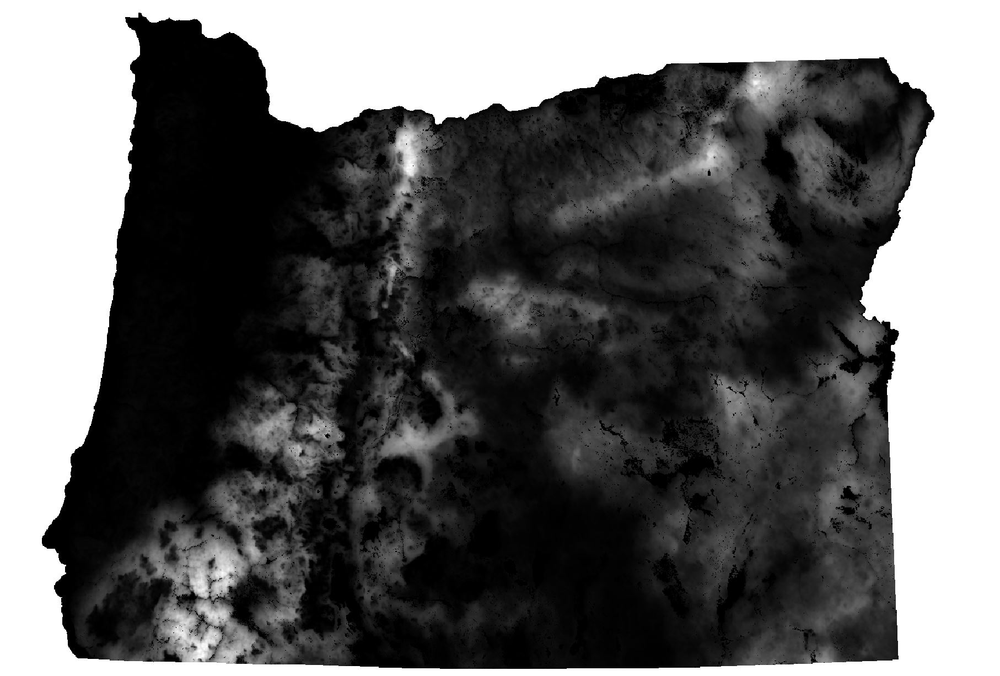
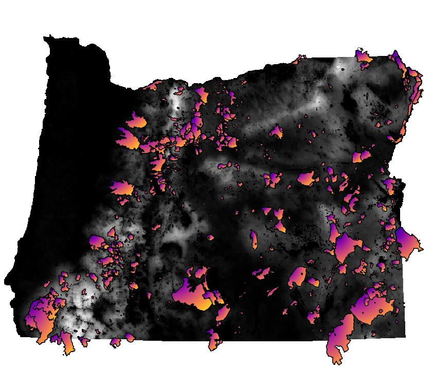

# Under Fire: Rethinking Wildfire Predictions

  

**A Critical Analysis of Oregon State's Wildfire Hazard Model**

  

*Examining the probabilities and performance in forecasting wildfire occurrences*

    
---
  

**Curated by:** Jeremy Kauwe  
**Date:** 2/5/2025

  

## 1. Executive Summary

In public policy, models are expected to provide reliable, evidence-based insights that inform critical decisions. They must be rigorously validated and demonstrate predictive performance well above trivial baselines. It is unacceptable for a model—especially one that influences resource allocation and public safety—to perform on par with a random number generator.

Our analysis of Oregon State's Wildfire Hazard Model reveals alarming shortcomings:
- **Inaccuracy in Probability Assignment:** The model fails to distinguish between fire and no-fire events.
- **Randomness Equivalence:** When benchmarked against a random number generator, the model's ability to classify fire occurrences is no better than chance.
- **Severe Risk Overestimation:** The model inflates wildfire risk by nearly 80%, potentially leading to misdirected policy and resource decisions.

These findings raise serious questions about the validity of the methods used in assessing the model's outputs. For a tool intended to guide public policy, the expectation is clear: models must deliver actionable, robust, and clearly superior predictions—not results that mimic random chance.

## 2. Introduction

**Background:**  
Wildfire hazard assessment is a critical tool for land management, public policy, and disaster preparedness. These assessments rely on models that estimate the likelihood and potential impact of wildfires based on environmental conditions, historical data, and fire behavior simulations. A key component of these assessments is burn probability, which represents the estimated likelihood of a fire occurring in a given area. This probability is often combined with fire intensity predictions to produce a final hazard rating used in risk mitigation strategies. However, the modeling process used to esimate the 2025 Oregon Wildfire hazard map is not well documented, making it difficult to assess the validity of its outputs.

**Purpose:**  
This report evaluates the relationship between the model’s probability output and its ability to distinguish between large fire events and non-fire events.

**Scope:**  
This analysis focuses on probability model outputs for all of Oregon to determine whether the model meets the necessary standards for guiding public policy and wildfire risk management.

## 3. Data and Methodology

### Data Sources  

The data used in this analysis comes from multiple sources, including model outputs from Oregon State University, historical wildfire occurrence records, and a transformed dataset created by combining these sources. These datasets were obtained through Oregon State’s Wildfire Hazard Risk **Point of Contact (POC)** and serve as the foundation for evaluating the burn probability component of the wildfire hazard model.

- **Transformed Data:**  
  This dataset is derived from a combination of **burn probability estimates** from the wildfire hazard model and **historical wildfire records**. Each row in the dataset represents a single **pixel** where these two datasets overlap. The dataset includes:  
  - **Burn Probability:** The probability of fire occurrence for that pixel, as assigned by the wildfire hazard model.  
  - **Fire Occurrence Flag:** A binary indicator (1 = fire occurred, 0 = no fire) derived from historical wildfire data.  
  - **Spatial Resolution:** Each pixel is spaced **500 feet apart** both vertically and horizontally, ensuring a uniform grid structure.

- **Wildfire Hazard Model Data:**  
  This dataset, provided by Oregon State, was used to build the wildfire hazard model. The burn probability outputs are stored in a geodatabase and were extracted for analysis.  
  **Path to Burn Probabilities:**  
  `SB80PublicData >> FireModelingData >> FireModeling_FuelscapeData.gdb >> BurnProbability`

- **Historical Fire Data:**  
  This dataset contains recorded wildfire events from **2000 to 2021** and was used to validate the model’s predictive accuracy. The dataset includes only fire events where **acres burned exceeded 247**, ensuring that only significant fire occurrences were considered. To maintain the focus on naturally occurring and uncontrolled wildfire events, **prescribed burns and resource management fires were excluded** from the analysis.

A full list of dataset links and additional details can be found in the **[GitHub README](https://github.com/yourusername/wildfire-risk-analysis/blob/main/README.md)**. For further information or verification, inquiries can be directed to **OSUwildfirerisk@oregonstate.edu**.

## Wildfire Burn Probability Map  
This map shows the burn probability predictions generated by the wildfire hazard model across Oregon.

## Burn Probability Overlaid with Historical Fire Data  
This map overlays the model’s burn probability layer with historical fire occurrences (2000-2021), highlighting areas where the model predicted fire risk versus actual fire events.

### Data Preparation  

The data was processed using **QGIS**, an open-source geographic information system. A full guide to downloading and installing **QGIS** can be found in the **[GitHub README](https://github.com/yourusername/wildfire-risk-analysis/blob/main/README.md)**. The following steps were taken to compile the **Transformed Data** for analysis:  

1. **Loading the Data:**  
   - The **burn probability layer** from the wildfire hazard model was uploaded into QGIS.  
   - The **historical fire occurrence dataset** was also uploaded.  

2. **Ensuring Consistent Coordinate Reference System (CRS):**  
   - Both datasets were checked to confirm they used the same **Coordinate Reference System (CRS)** to ensure spatial accuracy.

3. **Creating a Grid of Points:**  
   - A grid of points was generated, with each point spaced **500 feet apart** both **vertically** and **horizontally** across Oregon.  
   - This ensured that the data was evenly sampled across the study area.

4. **Extracting Burn Probability and Fire Occurrence:**  
   - For each grid point, the corresponding **burn probability** value was captured from the model output.  
   - The historical fire dataset was overlaid, and a **binary fire occurrence flag** was assigned:  
     - `1` if a fire was recorded at that location.  
     - `0` if no fire was recorded.

5. **Handling Null Values:**  
   - Some fires extended beyond **Oregon's boundaries**, resulting in missing burn probability values.  
   - These **null values** were removed to ensure clean and complete data.

6. **Exporting the Final Dataset:**  
   - The cleaned grid layer was saved and exported as a **CSV file**.  
   - This CSV file, referred to as the **Transformed Data**, is available in the **ZIP file linked in the README**.  

This transformed dataset serves as the foundation for evaluating the **relationship between burn probability estimates and actual fire occurrences** in Oregon.

